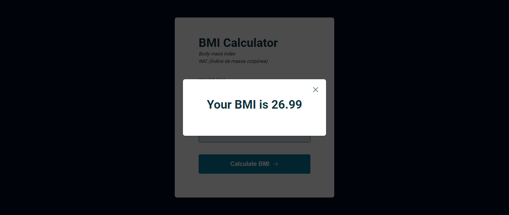

# Project 10 - BMI Calculator (Body Mass Index)

Project developed during the Explorer Program, Class 06, Stage 05, Rocketseat, in Dec/22.

🔗 [Click here to access]()

## Technologies

- HTML
- CSS
- JavaScript
- Git e Github

## Contacts

🔗 [Linkedin](https://www.linkedin.com/in/renato-malbuquerque/)
🔗 [Business Card](https://renato-albuquerque.github.io/rma-contacts/)